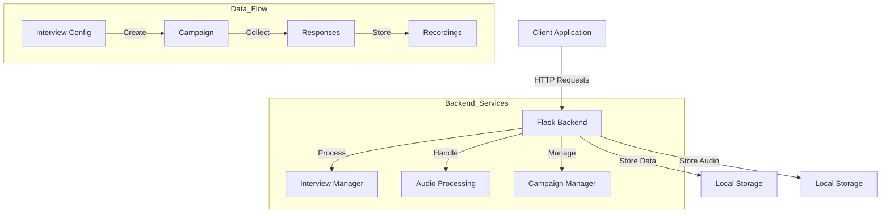

# Interview Recording System

## Features

- Create and manage interview campaigns
- Record and upload audio responses
- Store and retrieve interview recordings
- Firebase integration for data persistence (TODO: for now mocked with local storage)
- RESTful API endpoints for campaign management

## System Architecture



## Installation

1. Clone the repository:
```bash
git clone <repository-url>
cd interview_recording
```

2. Start the backend server:
```bash
./start.sh
```

3. The server will start on `http://localhost:8000`

## Running the Application

1. Run the cli_test.py to test the backend (feel free to mess around):
```bash
python backend/cli_test.py
```

2. Run the interactive interview (there is already a sample campaign created):
```bash
python backend/interactive_interview.py
```


## API Endpoints

### Campaign Management
- `POST /api/campaigns` - Create a new interview campaign
- `GET /api/campaigns` - List all campaigns
- `GET /api/campaigns/<campaign_id>` - Get specific campaign details

### Recording Management
- `POST /api/recordings/upload` - Upload an audio recording
- `GET /api/audio/<filename>` - Serve audio files

### Interview Management
- `POST /api/interviews/submit` - Submit a complete interview response
- `GET /api/campaigns/<campaign_id>/responses` - Get all responses for a campaign

## Project Structure

```
interview_recording/
├── backend/
│   ├── main.py              # Main Flask application
│   ├── models.py            # Data models
│   ├── storage_utils.py     # Storage utilities
│   ├── interactive_interview.py  # Interview logic
│   └── local_data/          # Local storage directory
├── requirements.txt         # Python dependencies
└── start.sh                # Startup script
```

## Resources:
DEV Stage
 Firestore: https://console.firebase.google.com/u/0/project/dev-volto-interviews/firestore/databases/-default-/data
 GCP Project: dev-volto-interviews 